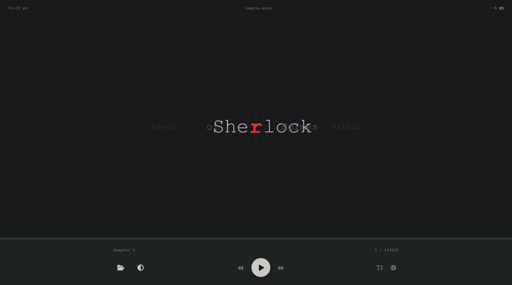
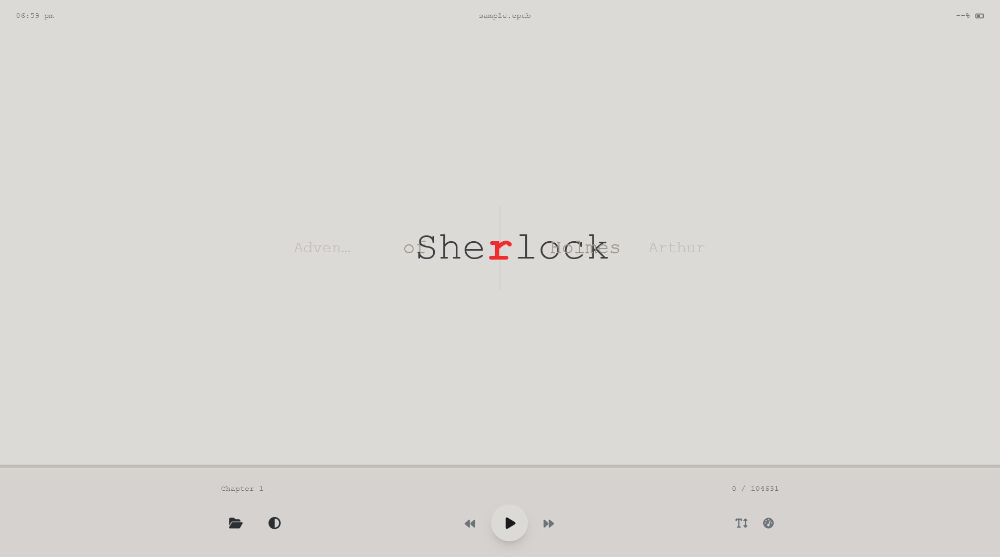

# OpenSpeedReader [[Live](https://singharindam.github.io/OpenSpeedReader/) | [GitHub](https://github.com/SinghArindam/OpenSpeedReader)]

OpenSpeedReader is a privacy-focused, browser-based speed reader leveraging **Rapid Serial Visual Presentation (RSVP)**. It processes generic **PDF** and **EPUB** files entirely client-side, enabling you to read at effectively double or triple your normal speed without compromising understanding.

## Screenshots

## Features

- **Format Support**: Secure, client-side parsing of **PDF** and **EPUB** files via Drag & Drop or File Picker.
- **RSVP Engine**: Scientifically tuned with Optical Recognition Point (ORP) alignment (red focus character).
- **Responsiveness**: Dynamic context words (1 word context on mobile, 2 on desktop) to reduce eye strain.
- **Customization**:
  - Adjustable **WPM** (Words Per Minute) from 100 to 1000.
  - Font size scaling.
  - Dark / Light mode toggle (with system preference detection).
- **Navigation**: Interactive progress timeline and keyboard shortcuts.
- **Zero-Server**: All file parsing happens locally in your browser/worker thread.

## Usage

1. **Open the Application**:
   - Visit the [Live Site](https://singharindam.github.io/OpenSpeedReader/).
   - OR open `index.html` locally in any modern browser.
2. **Load a Book**: Click the folder icon or drag a file (PDF/EPUB) onto the window.
3. **Start Reading**: Press `Space` or click the Play button.

## Keyboard Shortcuts

| Key | Action |
| :--- | :--- |
| **Space** | Play / Pause |
| **Right Arrow** | Jump Forward 10 lines |
| **Left Arrow** | Jump Backward 10 lines |
| **Up Arrow** | Increase Speed (+10 WPM) |
| **Down Arrow** | Decrease Speed (-10 WPM) |

## Documentation

- [License](./LICENSE)
- [Changelog](./development/changelog.md)
- [Detailed Changelog](./development/detailed_changelog.md)
